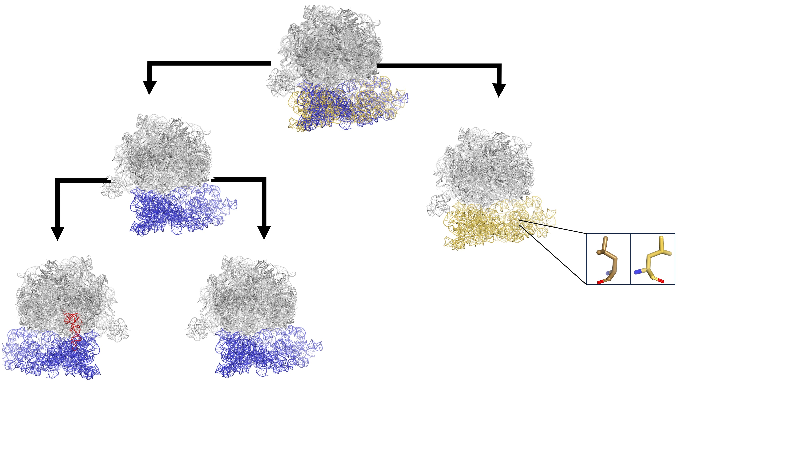

# QBI Macromolecular Conformational Ensembles: Statistical Structural Biology Modeling and Tools

{:style="max-width: 100%; height: auto;"}

 
Statistical structural biology seeks to move beyond structural biology's classic single dataset-single structure paradigm. The most compelling questions in structural biology—such as elucidating the dynamics of transient biological events, understanding allostery, and investigating how binding events alter the protein conformational landscape—cannot be effectively addressed using only a single structure. To tackle these challenges, we must embrace large-scale data analysis, statistical interpretation of conformational ensembles, and exploring the modeling relationships between multiple maps and models. This also requires integrating other datasets and approaches, including molecular dynamics (MD), genomics, and proteomics. 

This workshop aims to ignite innovative thinking about how our community can address current challenges in capturing and modeling conformational ensembles. We will accept talks from papers on aspects of statistical structural biology, broadly defined. Please head to the [abstracts](/abstracts) for more details. 

 
 
The workshop will take place on June 9th/10th at UCSF Mission Bay. Please head to the [information tab](/information) for more details. 

Please head to the [registration tab](/register) to register.

**Organizers:**
[James Fraser, UCSF](https://fraserlab.com/)
[Stephanie Wankowicz, Vanderbilt University](https://wankowiczlab.com/)

